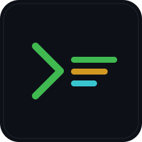

<p align="center">
  
</p>

<h1 align="center">axup</h1>

<p align="center">
  Ansible-style server provisioning and project rollout, in a single Go binary.<br/>
  Works natively on macOS, talks plain SSH, ships with an embedded remote agent.
</p>

---

## What it is

`axup` reads a YAML rulebook, opens an SSH connection to your server(s), uploads a small embedded agent into `/tmp`, and streams a plan of tasks to it: install packages, render templates, write configs, manage services, bring up Docker Compose stacks, build and push images, and so on. State (sha256 hashes of every managed file) lives on the remote, so re-runs only touch what actually changed.

Compared to Ansible: no Python on either side, no roles/handlers ceremony, two built-in verbs (`bootstrap` and `deploy`) plus `run <phase>` for any custom phase you declare, and everything that isn't a task is just one of seventeen well-defined task types.

## Quick start

```sh
# 1. Build (cross-compiles the agent for linux/amd64+arm64 and embeds it into the CLI)
make

# 2. Scaffold a rulebook
mkdir myproject && cd myproject
/path/to/axup/bin/axup init

# 3. Edit rulebook.yaml, then:
axup bootstrap --host root@1.2.3.4
axup deploy    --host root@1.2.3.4
```

A 5-minute end-to-end walkthrough lives in [doc/getting-started.md](doc/getting-started.md).

## Highlights

- **Seventeen task primitives**: `command`, `copy`, `template`, `mkdir`, `symlink`, `remove`, `user`, `group`, `chmod`, `chown`, `download`, `apt`, `service` (systemd + supervisor), `docker_install`, `docker_build`, `docker_compose` (with `wait: true` for healthcheck-gated readiness), `docker_login`
- **Arbitrary phases**: any top-level key in the rulebook besides the reserved ones becomes a phase — run `bootstrap:` / `deploy:` / `deploy_crash:` / `migrate:` / … via `axup run <phase>`
- **`axup logs <svc>...`**: tail per-service logs over SSH with `[host]` prefix, parallel across `--group`. Catalogs live under a `services:` block in the rulebook.
- **External vars file**: `--vars file.yaml` merges a per-env dict into rulebook vars (precedence: inventory > --vars > git auto > rulebook defaults).
- **Remote state with sha256 diffs**: re-applying a rulebook only touches files whose content or mode actually changed; out-of-band drift is detected
- **`axup status`**: read-only mode that reports `in_sync` / `drift` / `missing` for every tracked file on every host
- **`axup bootstrap --check`** (dry-run): see what would change without applying anything
- **Local submodules**: split one project across per-component subdirs (`mysql/`, `redis/`, `app/`) each with its own phased rulebook + templates; the parent splices them at exact positions via `use: ./mysql` (implicit phase match) or `use: ./mysql/deploy` (explicit). [Docs](doc/local-submodules.md).
- **External rulebook modules**: declare `deps:` with `{git, version}`, lock to SHAs, import sub-rulebooks via `use: common/mysql8`. [Docs](doc/external-rulebooks.md).
- **Inventory + multi-host**: optional `inventory.yaml` with named hosts, groups, and per-host vars; `--group prod` fans out in parallel via errgroup
- **Two encryption backends, auto-routed by extension**: sops-style structural for YAML/JSON/INI/ENV/TOML (leaf values encrypted, keys still readable in PR diffs); whole-file age armor for everything else (binaries, certs, .conf). One `recipients.txt`, one identity-discovery chain, transparent decrypt at deploy time. See [Encryption](#encryption) below.
- **Auth modes**: SSH key (auto-discover or `--key`), SSH password (`--password` / `--ask-password`), sudo with or without password (`--sudo` / `--sudo-password` / `--ask-sudo-password`)
- **Docker pipeline**: build images locally with `docker buildx`, push to your registry with `docker_login` creds, pull on the remote via `docker_compose pull` — all chained from one rulebook
- **`make install`**: drops `axup` into `$(PREFIX)/bin` (default `/usr/local`, override `PREFIX=$HOME/.local` to avoid sudo)
- **Colored output** with per-host summaries and a content-detecting plain/encrypted file path — `NO_COLOR` and `--no-color` honored
- **Git auto-vars**: `git_sha`, `git_short_sha`, `git_branch`, `git_dirty` are injected into the template context automatically — handy for `tag: "myapi:{{ .git_short_sha }}"`

## Encryption

axup ships two encryption backends in one binary — both use [age](https://age-encryption.org/) keys but apply them differently. The mode is chosen automatically by the file's extension:

| Extension | Mode | What the encrypted file looks like |
|---|---|---|
| `.yaml` `.yml` `.json` `.ini` `.toml` `.env` | **sops-style structural** — leaf values encrypted, keys remain plaintext | git-diffable; reviewers can see which key changed |
| anything else (`.pem`, `.conf`, `.crt`, binaries, …) | **whole-file age armor** | opaque base64 blob between `BEGIN/END AGE ENCRYPTED FILE` markers |

Trailing template suffixes (`.tmpl`, `.template`, `.j2`) are stripped before the lookup — `inventory.prod.yaml.tmpl` still routes to sops.

### What the difference looks like

A sops-encrypted YAML keeps shape:

```yaml
db:
  host: ENC[AES256_GCM,data:nxD+apD5g5voN50=,iv:...,tag:...,type:str]
  port: ENC[AES256_GCM,data:9ytE4w==,iv:...,tag:...,type:int]
  password: ENC[AES256_GCM,data:pHTWmctrdQAGtolHiTWxi/UmeHA=,...]
sops:
  age:
    - recipient: age10qd5pvuuvtpqv79rr4qgy87x7x3zgfkphcd5hkcalpkh8pfcvsms8aycgg
      enc: |
        -----BEGIN AGE ENCRYPTED FILE-----
        ...
    version: 3.13.1
```

A reviewer sees *which key* changed (`db.password`), not the value. Merge conflicts resolve per-line. A whole-file age blob can't do either — change one byte, the base64 changes from `BEGIN` to `END`.

### Recipients

Both modes read the same `recipients.txt`:

```
# Anyone listed here can decrypt. age1... lines are accepted by both
# backends; ssh-* lines work only for whole-file age (sops doesn't
# accept SSH keys without ssh-to-age conversion).
age10qd5pvuuvtpqv79rr4qgy87x7x3zgfkphcd5hkcalpkh8pfcvsms8aycgg   alice
age1y4mw...                                                       bob
ssh-ed25519 AAAA…                                                ci@build
```

Per-file recipient overrides in the rulebook let one project lock different files to different keysets — common pattern is stage vs prod:

```yaml
secrets:
  recipients_file: recipients.stage.txt    # default for any file below
  files:
    - secrets/db.pw                        # uses default
    - path: inventory.stage.yaml           # explicit override
      recipients: recipients.stage.txt
    - path: inventory.prod.yaml
      recipients: recipients.prod.txt      # locked to prod keyring
```

### Decryption is automatic

Files don't carry a "what backend" marker — `axup` sniffs the content (`-----BEGIN AGE…` → age; `ENC[AES256_GCM,…` anywhere in the body → sops). All tasks that read encrypted files (`docker_login.creds_file`, `--inventory`, …) do this transparently.

### No runtime dependencies

The sops backend uses the official sops Go library ([github.com/getsops/sops/v3](https://github.com/getsops/sops/v3)) linked directly into `axup` — no separate `sops` binary on PATH required. Cost: the CLI binary is ~46 MB (the polymorphic key-source design pulls in cloud-KMS sub-packages even though axup only uses age).

Full reference + identity-discovery chain in [doc/secrets.md](doc/secrets.md).

## Version & updating

`axup version` (or `axup --version` / `-v`) prints the build's tag, commit and date:

```
$ axup version
axup v0.0.3 commit=ab12cde built=2026-05-16T20:17:40Z darwin/arm64
```

The tag is taken from `git describe --tags --always --dirty` at build time. A clean release looks like `v0.0.3`; a build on top of `v0.0.3` with local changes shows `v0.0.3-2-gab12cde-dirty`.

There is **no `axup update` / `self-update` command** — updating is a `git pull && make install`:

```sh
cd /path/to/axup
git pull
make install                          # → /usr/local/bin/axup (uses sudo if needed)
# or, to install into your user prefix without sudo:
make install PREFIX=$HOME/.local      # → $HOME/.local/bin/axup
axup version                          # confirm new build
```

`make install` always rebuilds, embeds a fresh agent for `linux/{amd64,arm64}`, and overwrites the binary at `$(PREFIX)/bin/axup`. To downgrade, `git checkout v0.0.2 && make install`.

## Documentation

| Doc | What it covers |
|---|---|
| [Getting started](doc/getting-started.md) | Build, scaffold, first bootstrap and deploy in ~5 minutes |
| [Rulebook reference](doc/rulebook-reference.md) | Every task type and field, with copy-paste-ready YAML |
| [Inventory & multi-host](doc/inventory-multi-host.md) | `inventory.yaml`, `--host` vs `--group`, per-host vars, parallel runs |
| [Secrets (age + sops)](doc/secrets.md) | Both backends, recipients, identity discovery, multi-developer setup, per-file recipients |
| [Local submodules](doc/local-submodules.md) | Split one project across `mysql/`, `redis/`, … subdirs and splice them into the parent via `use: ./...` |
| [External rulebooks](doc/external-rulebooks.md) | `deps:`, `use:`, `axup.lock`, module layout, var merge precedence (for git-versioned modules) |
| [CLI reference](doc/cli-reference.md) | Every command, every flag, every env var |

## Example projects

The repository ships five end-to-end examples, each runnable against a real Linux box you have SSH access to:

| Example | Demonstrates |
|---|---|
| [examples/simple](examples/simple) | `copy` + `template` + `when_changed` |
| [examples/server](examples/server) | `apt` + `docker_install` + `service` + `docker_compose` + supervisor-managed process |
| [examples/build](examples/build) | Local `docker_build --push` + remote `docker_compose pull` with encrypted registry creds |
| [examples/use](examples/use) | External rulebook module loaded via `deps:` + `use: common/echo` |
| [examples/multihost](examples/multihost) | `inventory.yaml`, two logical hosts, parallel `--group all` |

## Architecture in one paragraph

The CLI is a single Go binary (`cmd/axup`). Inside it lives the cross-compiled `axupd` agent for `linux/amd64` and `linux/arm64`, embedded via `//go:embed`. On every run the CLI uploads the agent into `/tmp/axupd-<rand>` via `ssh ... 'cat > path && chmod +x'`, pipes a JSON `Plan` to its stdin, and reads newline-delimited `Event` JSON from its stdout. The agent maintains `~/.axup-state/<rulebook>/state.json` for idempotency and gets removed from `/tmp` at the end. Local-only tasks (`docker_build`, `docker_login` for the CLI side) run before SSH opens. See [doc/cli-reference.md](doc/cli-reference.md#wire-protocol) for the wire details.

## License

MIT.
